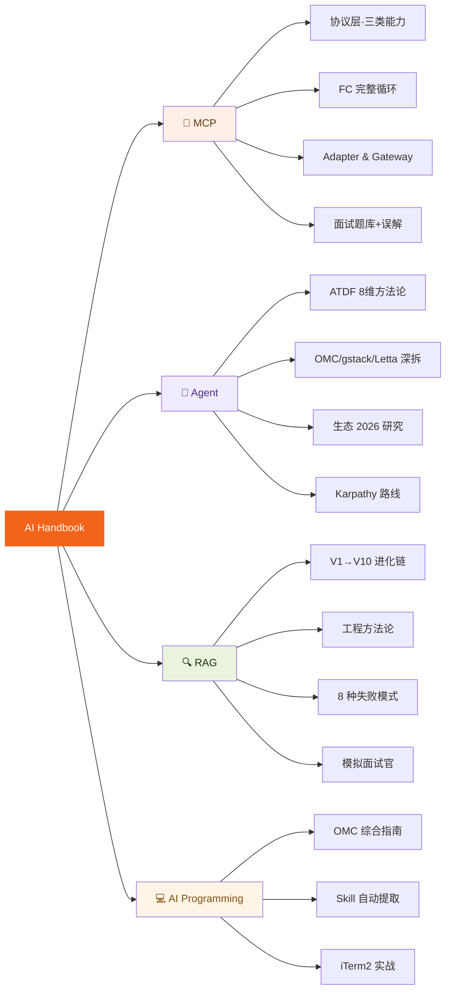

<div align="center">

# 🧭 Learn AI Engineering

### *Learn AI engineering by reading someone else's mistakes.*

**AI 工程师的"不整理"笔记本 — 保留困惑 · 保留追问 · 保留误解**

[](./content)
[](./interactive)
[](./code)
[](./web)
[](#license)
[]()

**MCP · Agent · RAG · AI Programming · Methodology**

**[🌐 在线文档站](https://bob798.github.io/learn-ai-engineering/)** · **[📖 交互笔记合集](./interactive)** · **[💻 Runnable Code](./code)** · **[📮 AI 开发日记](https://bob798.github.io)**

</div>

---

## 🎯 为什么看这个仓库

市面上不缺 AI 教程，但大多数是这样：

> ✅ "这里是标准答案"
> ❌ "原作者其实也踩过坑 —— 但没写出来"

**这个仓库反过来做** ——

- 📝 **保留误解** · 每个主题都记录了"我理解错的那个版本"
- 🔁 **保留追问** · 重要概念都经过 5+ 轮深度追问（不是 Wiki 式的概括）
- 🧩 **保留体系** · 不是一个松散的 awesome list，是一张可导航的知识图谱
- 🎨 **保留交互** · 27 个浏览器就能打开的交互式笔记，不是静态幻灯片

> 如果你在学同样的内容、踩过同样的坑，这里比标准答案更有参考价值。

---

## 📊 内容概览

| 主题 | 文档 | 交互笔记 | 可运行代码 | 进度 |
|---|:-:|:-:|:-:|---|
| **🔌 MCP** · 模型上下文协议 | 10 | 2 | 4 .py | 🟢 相对完整 |
| **🤖 Agent** · 智能体与方法论 | 13 | 6 | — | 🟢 成体系 |
| **🔍 RAG** · 检索增强生成 | 19 | 9 | 15 .py | 🟢 V1-V10 代码 |
| **💻 AI Programming** · 工程实战 | 10 | 10 | — | 🟡 持续更新 |
| **总计** | **52** | **27** | **19** | |

---

## 🗺️ 内容地图



---

## 🎯 按场景推荐入口

### 🎓 准备 AI 技术面试
- [MCP 面试题库](./content/01-mcp/05-interview/qa.md) — 基础 + 进阶 + 实战，附一句话版
- [MCP 11 个深度追问](./content/01-mcp/05-interview/mcp-11q.md) — Prompt 模板 / Gateway / FC 机制 / 语义透明
- [MCP · 理解错的 10 件事](./content/01-mcp/05-interview/common-misconceptions.md) — 真实误解记录
- [RAG 模拟面试官](./content/03-rag/mock-interview/) — 8 篇高频面试专题

### 🏗️ 学 Agent 系统架构
- [ATDF 8 维度拆解框架](./content/02-agent/methodology/ATDF.md) — 套这个模板分析任何 AI 项目
- [OMC 多 Agent 编排深拆](./content/02-agent/deep-dives/omc/omc-atdf.md)
- [Ralph 自省循环模式](./content/02-agent/deep-dives/omc/ralph-deep-dive.md)
- [gstack AI 编程方法论](./content/02-agent/deep-dives/gstack/gstack-atdf.md)
- [Agent 生态 2026 全局观](./content/02-agent/research/agent-ecosystem-2026.md)

### 🔍 RAG 工程实战
- [V1 → V10 完整进化链](./code/rag) · 15 个版本的 Python 代码，可直接跑
- [工程方法论手册](./content/03-rag/04-工程方法论手册.md) · 5 步方法 + 8 种失败模式
- [混合检索 RRF 平局陷阱](./content/03-rag/mock-interview/05_混合检索RRF平局陷阱专题分析.md)
- [Embedding 选型 + 合成 Query](./content/03-rag/mock-interview/06_embedding选型参考与合成Query.md)

### 🧠 方法论 & 思考框架
- [5D 知识习得方法](./content/02-agent/methodology/5d-framework.md) · 可迁移到任意新领域
- [从 RAG 到 Memory · 演化路线](./content/02-agent/concepts/rag-to-memory.md)
- [Karpathy · LLM OS → LLM Wiki → Software 3.0](./content/02-agent/concepts/karpathy-route.md)

### 🎨 交互式笔记（浏览器打开）
- [MCP 深度追问系列](./interactive/mcp/) · 11Q + 5Q
- [RAG 概念手册：向量与检索](./interactive/rag/) · 带类比动画
- [Agent Loop Viz](./interactive/agent/agent-loop-viz.html) · RAF 驱动的循环可视化

---

## 🚀 本地启动 Docs Site

```bash
git clone https://github.com/bob798/learn-ai-engineering.git
cd learn-ai-engineering/web
pnpm install
pnpm dev                 # → http://localhost:3000
```

**站点技术栈**：Next.js 16 · Tailwind v4 · remark/rehype · framer-motion

**构建管线**：`predev` / `prebuild` 自动跑 `scripts/extract-content.ts`，扫描 `content/` 生成 `docs.json`，`interactive/` 通过 symlink 暴露为 `/viz/...`。

---

## 🧪 跑 MCP Demo

```bash
cd code/mcp-demo
python3 -m venv .venv && source .venv/bin/activate
pip install -r requirements.txt
python hello-server-mcp.py                             # 最简 Server
NOTES_PATH=/your/notes python file-server-mcp.py       # 搜索本地笔记
```

Claude Desktop 配置见 [code/mcp-demo/README.md](./code/mcp-demo/README.md)。

---

## 🏗️ 项目结构

```
learn-ai-engineering/
├── content/          52 篇 Markdown（Next.js 构建目标）
│   ├── 01-mcp/
│   ├── 02-agent/
│   ├── 03-rag/
│   └── 04-ai-programming/
├── interactive/      27 个交互 HTML（浏览器直接打开）
│   ├── mcp/  agent/  rag/  ai-programming/
├── code/             可运行示例
│   ├── mcp-demo/     Python MCP Server
│   └── rag/          V1-V10 RAG 代码 + 测试
└── web/              Next.js 16 文档站
    ├── scripts/      extract-content.ts（构建期扫描）
    └── src/          App Router 页面 + 组件
```

---

## 🏷️ Tags

`#MCP` `#AI-Agent` `#RAG` `#LLM` `#Claude-Code` `#AI-Engineering`
`#Function-Calling` `#Prompt-Engineering` `#Vector-Search` `#Embedding`
`#Next.js` `#TypeScript` `#中文技术文档` `#面试备战` `#知识图谱`

---

## 🧭 写作风格

这些笔记**不是**：
- ❌ 抄来的定义汇总（wiki 已经做了）
- ❌ 给 AI 初学者的导论（网上一抓一大把）
- ❌ 最佳实践总结（那只是结果，不是过程）

这些笔记**是**：
- ✅ 我从完全不懂到理解的**完整追问链**
- ✅ 一个个"本来以为是 X，结果是 Y"的**反转记录**
- ✅ 可以在 5 年后也有人参考的**体系化路径**

---

## 🤝 欢迎贡献

- 🐛 发现内容错误 → 开 Issue 或直接 PR
- ✍️ 有相同主题的不同角度思考 → 欢迎补充
- 💡 想学但这里还没覆盖的主题 → 留个 Discussion 说说
- ⭐ 觉得有用 → Star 让更多人发现

---

## 📬 关于作者

[@bob798](https://github.com/bob798) · AI 应用工程师

- 📖 [AI 开发日记](https://bob798.github.io) — 技术文章与行业观察
- 🌐 [在线文档站](https://bob798.github.io/learn-ai-engineering/)
- 💌 发现错误或有更好理解，欢迎开 Issue

---

## License

MIT — 自由使用、修改、传播。署名不强制但欢迎。

---

<div align="center">

**如果这些笔记让你少走了弯路，点个 ⭐ Star 让更多人看到 👇**

</div>
