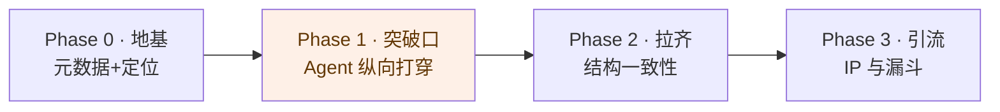

# 知识库优化路径

> **总判断**：这个库是"横向拆解深、纵向贯通浅"。RAG 是唯一做到纵向贯通的主题（原理→手写 V1-V10→评估→复盘），所以一枝独秀。
> 优化的唯一主线就是一句话——**停止铺面，把 Agent 按 RAG 的模式打穿，再把结构成熟度拉齐。**

---

## 一、取舍决策框架（先有标尺，再排活）

不靠感觉选下一篇，靠打分。每个候选内容：

```
优先级 =  差异化(1-3) × 纵深贡献(1-3) × 复利性(1-3)
          ──────────────────────────────────────
                     腐烂速度(1-3)
```

| 因子 | 1 分 | 3 分 |
|---|---|---|
| **差异化** | 全网都有的概述 | 命中 `保留困惑`/`纵向贯通`/`可运行`/`ATDF深拆` 多项 |
| **纵深贡献** | 又开一个新主题铺面 | 补上某主题"原理→生产"链条的缺环 |
| **复利性** | 3 年后过时 | 第一性原理，3 年后仍成立 |
| **腐烂速度** | 第一性原理(1) | 某框架的当下用法/趋势(3) |

样例打分：

| 候选 | 分数 | 结论 |
|---|---|---|
| 从零手写 Agent (V1-V10) | 3×3×3÷1 = **27** | 立刻做 |
| Agent 评估框架 | 3×3×2÷1 = **18** | 紧随其后 |
| 多 Agent 协作模式 | 2×3×2÷1 = **12** | 第二梯队 |
| 填 05/06 毛坯 | 2×1×2÷2 = **2** | 暂缓 |
| LangGraph vs CrewAI 横评 | 2×1×1÷3 ≈ **0.7** | Scan 档快过，不深做 |

> 四条建设原则（标尺背后的价值观）：**纵深 > 铺面** · **差异化密度**（不能体现差异化的不写）· **复利资产 > 易腐资产** · **一致性 > 数量**（毛坯就显式标 `seedling`）。

---

## 二、分阶段路线



### Phase 0 · 地基（半天，必须先做）

| 动作 | 产出 | 验收 |
|---|---|---|
| 全量补 frontmatter `status/topic/updated` | ~70 篇 md 统一头 | 每篇能被脚本读出成熟度 |
| README 改"免费知识库"定位 | 消除"全免费 vs 收费"认知冲突 | 首屏说清三层(个人KB/传播/引流) |
| 过程文档与产出分离 | `PLAN.md`/`RETROSPECTIVE.md` 收进 `_meta/` 或显式标 | 读者不再撞到"建设计划" |

> 为什么先做：成熟度元数据是后面站点徽章、路径生成、漏斗筛选的地基。半天投入，撬动后面全部自动化。

### Phase 1 · 突破口：Agent 纵向打穿（主战场）

施工图已就位 → [`02-agent/agent-from-scratch/README.md`](../02-agent/agent-from-scratch/README.md)

| 顺序 | 动作 | 分数 | 验收 |
|---|---|---|---|
| 1 | **V1 最小 Agent 循环**（代码+讲解） | 27 | `python` 跑通；证明整条线成立 |
| 2 | V2-V3 ReAct + 多工具路由 | 27 | 串入 `papers/react-paper.md` |
| 3 | V4-V5 记忆（复用 `code/memory`） | 18 | 把已有 memory 代码"串进 agent 循环" |
| 4 | V6-V7 规划 + 反思 | 15 | — |
| 5 | **V8 评估框架**（填最大空白） | 18 | 轨迹评估能跑出成功率/成本 |
| 6 | V9 多 Agent | 12 | supervisor/worker/debate 各一段 |
| 7 | **V10 生产化 + 安全**（填第二空白） | 18 | tracing + 死循环防护 + 注入防护 |

> 做完 1-3，Agent 就从"概念合集"变"纵向贯通主题"；做完全部，与 RAG 并列为双标杆。

### Phase 2 · 结构一致性拉齐（Agent 打穿后）

| 动作 | 说明 |
|---|---|
| MCP 补"中间层" | 现在两头薄(概念+demo)，补协议细节/传输/鉴权/真实集成踩坑 |
| 三套资产建映射 | 每个主题一张"该按什么顺序看 md/html/code"的入口表（学 RAG 的 `index` 分流） |
| 命名规则统一 | 收敛到一套(中文名+数字前缀 或 英文目录)，降低检索心智负担 |
| 05/06 二选一 | 要么做深一个，要么都标 `seedling` 停工——别让毛坯假装成品 |

### Phase 3 · IP 与引流（内容到一定密度后）

| 动作 | 说明 |
|---|---|
| 养 `_framework/` 与架构系列(`04-ai-programming/architecture-series/`) | 方法论母体(5D/ATDF)是护城河；架构系列是获客引擎，固定节奏更新 |
| web 站点加成熟度徽章 + 文末 CTA | 🌱/🌳 强化"保留过程"人设；CTA 指向独立站课程 |
| 漏斗闭环 | 免费内容 → 社群/邮件 → 独立站付费课程 |

---

## 三、明确的"不做"清单（同样重要）

| 不做 | 理由 |
|---|---|
| ❌ 再开 07/08 新主题 | 铺面是当前最大的诱惑，也是最大的错误 |
| ❌ 急着填 05/06 毛坯 | 分数太低(2)，复利不足，等 Agent 打穿再说 |
| ❌ 深做框架横评 | 腐烂快，只配 ATDF Scan 档 |
| ❌ 把课程内容放进本库 | 本库定位纯免费；课程在独立站交付 |

---

## 一句话收尾

**当前唯一该集中火力的事：跑通 `agent-from-scratch` 的 V1，验证纵向主线成立，然后一路推到 V8 评估、V10 生产。** 其余一切等这条线打穿再说。
