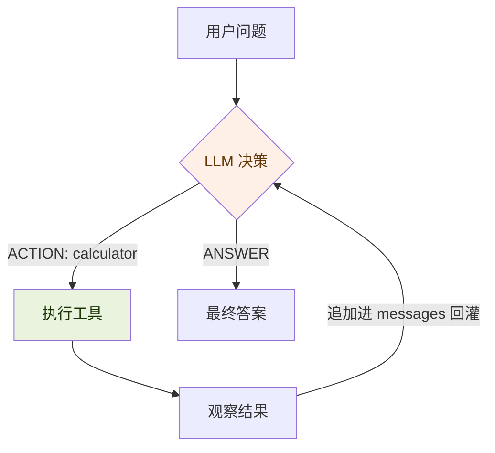

# 代码讲解 · V1 最小 Agent 循环

> 这页不负责逐行注释，负责讲清**数据怎么流动**、**为什么这么设计**、**我踩的坑**。
> 代码：[`code/agent/01_v1_最小agent循环.py`](../../../code/agent/01_v1_最小agent循环.py)
> 先离线跑通再读：`python 01_v1_最小agent循环.py --selftest`

---

## 一句话：V1 想证明什么

> **Agent 不是一个更聪明的模型，而是同一个模型 + 外面那个 `while` 循环。**

V1 用一个最干净的对比把这件事钉死——和 RAG 的「有无 RAG」完全对称：

| | 无 Agent 循环 | 有 Agent 循环 |
|---|---|---|
| 做法 | 直接把问题丢给 LLM，让它心算 | 模型自己决定调 `calculator`，循环把结果喂回去 |
| 一个多步算术题 | 经常算错（模型不是计算器） | 精确得到 4369 |
| 多出来的能力 | — | **不是模型变强了，是循环让它能「算」** |

---

## 数据怎么流动

核心就是 `run_agent()` 里那 ~20 行：

1. **感知**：把 `messages`（含历史）交给 `llm`
2. **决策**：模型回一行——`ACTION: calculator(...)` 或 `ANSWER: ...`
3. **解析**：`parse_step()` 把这一行解析成 `(类型, 内容)`
4. **行动**：是 action 就执行工具，得到「观察」
5. **回灌**：把「模型的决策」和「观察结果」都 **追加进 `messages`**，回到第 1 步
6. **终止**：是 answer 就返回；步数耗尽则触发兜底

> 第 5 步的「追加进 messages」就是**记忆的雏形**——V4 会把它升级成真正的短期记忆管理（裁剪、摘要）。

---

## 三个刻意的设计选择（每个都为后面铺路）

### ① 为什么 V1 用文本协议，不用原生 function calling？

V1 让模型回 `ACTION:` / `ANSWER:` 两种纯文本格式，自己写 `parse_step()` 解析。
**故意的**——把「解析模型意图」这一步赤裸地暴露出来，你才会真切体会到：

- 模型不按格式回怎么办？（V1 给一次纠正机会，V7 专门做错误恢复）
- 原生 function calling 其实就是厂商帮你把这套「协议 + 解析」标准化了（V3 切过去对比）

### ② 为什么只给一个工具，而且是计算器？

计算器**确定性、可验证、且模型常算错**——最能干净地证明「循环带来了模型本身没有的能力」。
多工具与工具路由（模型选错工具的问题）留给 V3。

### ③ 为什么把 LLM 做成可注入参数？

`run_agent(question, llm=...)` 的 `llm` 是个 `(messages) -> str` 函数：

- 真实运行传 `provider.chat`
- `--selftest` 传一个**脚本化的假模型**

这样**循环逻辑能在零依赖、零 API Key 下被验证**。这不只是为了测试方便——
把「决策来源」与「循环骨架」解耦，本身就是 Agent 工程的好习惯（V8 评估、V9 多 Agent 都依赖这个解耦）。

---

## 保留的困惑（我以为 … 其实 …）

> **我以为** Agent 是「给模型加了 buff、变得会用工具的高级模型」。
> **其实** 模型从头到尾没变——它只会输出文本。会用工具的是**外面那段代码**：
> 是我解析了它的文本、替它执行了工具、把结果再塞回它的上下文。
> 「Agent 的智能」有一大半住在循环里，不在模型里。

这个认知直接决定了后面所有版本的走向：ReAct（V2）是优化**决策的表达**，
记忆（V4-V5）是优化**回灌什么**，评估（V8）是评估**整条轨迹**而不只是最后那句答案。

---

## 自测里验证了什么

`--selftest` 不需要 API，就钉死了四件事：

| 验证项 | 为什么重要 |
|---|---|
| `parse_step` 三种格式 | 解析错了，循环就跑偏 |
| `calculator` 算对 **且拒绝注入** | `eval` 禁用了 builtins——工具安全是 V10 的预演 |
| 完整循环跑出 4369（恰好 3 次模型调用） | 证明「决策→工具→回灌→再决策」闭环成立 |
| `max_steps` 兜底 | 模型死循环时安全退出——V7/V10 会强化的失败模式 |

---

## 下一步

→ **V2 · ReAct**：把模型这一步的输出从「单行 ACTION」升级成
`Thought（为什么这么做）/ Action / Observation` 三段式，观察「让模型显式写出推理」
到底改善了什么、又多花了多少 token。代码：`02_v2_react模式.py`（施工中）。
