# 从零手写 Agent · V1→V10

> **结论先行**：Agent 主题之前的内容都是"拆别人的框架"(ATDF 横向深)，缺一条"自己从 0 造"的纵向主线。
> 这条主线对标 [`03-rag` 的 V1→V10](../../03-rag/README.md)——每个版本一段**可运行**的纯 Python 代码 + 一篇配套讲解，
> 把 Agent 从"最小感知-决策-行动循环"一路打穿到"带评估、带可观测、带安全防护的生产级"。
>
> 做完这条线，Agent 就从"概念合集"升级为和 RAG 并列的"纵向贯通主题"。

---

## 为什么是"手写"，不是"教你用 LangGraph"

| 路线 | 价值 | 腐烂速度 |
|---|---|---|
| 教你用某框架 | 学完会用一个工具，框架一升级就过时 | 快（3=高） |
| **从零手写** | 学完理解 Agent 的**第一性原理**，任何框架都看得穿 | 慢（1=低） |

差异化密度：这条线同时命中你的四个差异化资产——`可运行` · `纵向贯通` · `保留困惑`(每版一个"我以为…其实…") · 第一性原理。框架横评(LangGraph/CrewAI/Agents SDK)留给 ATDF **Scan 档**快速过，不在这条主线里深做。

---

## 版本路线图（对标 RAG V1-V10）

```mermaid
graph LR
    V1[V1 最小循环] --> V2[V2 ReAct]
    V2 --> V3[V3 多工具路由]
    V3 --> V4[V4 短期记忆]
    V4 --> V5[V5 长期记忆]
    V5 --> V6[V6 规划分解]
    V6 --> V7[V7 反思自纠]
    V7 --> V8[V8 评估框架]
    V8 --> V9[V9 多Agent协作]
    V9 --> V10[V10 生产化]

    style V1 fill:#fef0e7,color:#633806
    style V8 fill:#fcebeb,color:#501313
    style V10 fill:#eaf3de,color:#173404
```

| 版本 | 主题 | 核心机制 | 对标 RAG | 一个"保留的困惑" | 产出 |
|---|---|---|---|---|---|
| **V1** | 最小 Agent 循环 | 纯手写 `while` 循环：LLM 决策 → 调一个工具 → 把结果喂回去 → 再决策。无框架。 | V1 最小 RAG 循环 | "Agent 不是模型能力，是**外面那个循环**" | `01_v1_最小agent循环.py` |
| **V2** | ReAct 模式 | 手写 Thought/Action/Observation 的 prompt + 解析器，对比"裸 function calling vs ReAct 显式推理" | V2 分块策略 | "ReAct 的 Reasoning 不是模型在想，是 prompt 逼它写出来" | `02_v2_react模式.py` |
| **V3** | 多工具与路由 | 工具注册表、tool schema 自动生成、parallel tool calls、工具选择错误的兜底 | V3 向量库集成 | "工具多了，模型选错工具比答错更常见" | `03_v3_多工具路由.py` |
| **V4** | 短期记忆 | 对话缓冲、上下文窗口管理、消息裁剪/摘要（复用 `code/memory/01`） | V4 embedding 选型 | "上下文不是越长越好，塞满反而变笨" | `04_v4_短期记忆.py` |
| **V5** | 长期记忆 | 向量记忆 + 检索 + 写穿透（复用 `code/memory/02-03`），把 RAG 降级成 Agent 的一个工具 | V5 混合检索 | "RAG 不是终点，是 Agent 记忆的一个原语" | `05_v5_长期记忆.py` |
| **V6** | 规划与分解 | Plan-and-Execute：先生成计划再逐步执行，对比 ReAct 的"走一步看一步" | V6 reranking | "复杂任务，先规划再执行 vs 边走边想，谁更省 token" | `06_v6_规划分解.py` |
| **V7** | 反思与自纠 | Reflexion / self-critique / 工具报错后的错误恢复循环 | V7 query 变换 | "Agent 卡死，多半不是不会，是不会**承认自己错了**" | `07_v7_反思自纠.py` |
| **V8** ⭐ | **评估框架** | **轨迹(trajectory)评估、工具调用正确率、多步任务成功率、成本/延迟**——你最显眼的空白 | V8 评估框架 | "Agent 比 RAG 难评估：对的答案 + 错的路径，算成功吗？" | `08_v8_评估框架.py` |
| **V9** | 多 Agent 协作 | supervisor / worker / debate 三模式，各一段可跑代码 | V9 agentic RAG | "多 agent 不是更聪明，是更贵——什么时候值得" | `09_v9_多agent协作.py` |
| **V10** ⭐ | **生产化** | **可观测性/tracing、失败模式防护(死循环/成本爆炸)、tool 结果里的 prompt injection 防护、沙箱** | V10 enterprise | "上线后第一个炸的不是准确率，是成本和死循环" | `10_v10_生产化.py` |

⭐ = 三个最致命空白里的两个（评估、生产/安全）落在这里；第三个空白"多 Agent"是 V9。

---

## 配套文档（对标 RAG docs）

每个里程碑配一篇讲解，不是逐行注释，而是"数据流 + 为什么这么设计 + 我踩的坑"：

| 文档 | 角色 | 覆盖版本 |
|---|---|---|
| `00_agent路线图.md` | 学习顺序，先学什么后学什么 | 全部 |
| `01_概念_agent是什么.md` | 概念直觉：循环、状态、工具、记忆的关系 | 跑 V1 前读 |
| `02_代码讲解_V1V2.md` | 数据流：最小循环 → ReAct 怎么工作 | V1-V2 |
| `03_工程方法论_评估与失败模式.md` | 项目落地：怎么评估、怎么防死循环和注入 | V8-V10 |
| `agent-knowledge-map.md` | 系统全貌：模块关系（呼应 `memory/rag-to-memory.md`） | 全部 |

> 复用已有资产：`harness/agent-loop.md`(并入 V1 讲解)、`papers/react-paper.md`(并入 V2)、`code/memory/*`(并入 V4-V5)、`code/react-hands-on/*`(V2 的进阶参考)。不重写，只串线。

---

## 与现有 Agent 内容的关系（不重叠）

| 现有 | 层次 | 与本主线的关系 |
|---|---|---|
| `methodology/ATDF.md` | 拆解方法论 | 用来 Scan 档快过外部框架，不进主线 |
| `deep-dives/omc·gstack` | 拆别人的框架 | 横向深，**本主线是纵向深**，互补 |
| `papers/react-paper.md` | 论文理论 | 并入 V2 作为理论根基 |
| `harness/agent-loop.md` | 循环原理 | 并入 V1 作为概念前置 |
| `memory/rag-to-memory.md` | 演化叙事 | 并入 V5 解释"RAG→记忆原语" |

---

## 施工状态

- [x] **V1 最小循环** — ✅ 已完成：[代码](../../../code/agent/01_v1_最小agent循环.py)（含 `--selftest` 离线自测）+ [讲解](02_代码讲解_V1V2.md)。整条纵向主线已验证成立。
- [ ] V2 ReAct
- [ ] V3 多工具路由
- [ ] V4-V5 记忆（复用 `code/memory`，重点是"串进 agent 循环"）
- [ ] V6-V7 规划与反思
- [ ] **V8 评估框架**（填最大空白）
- [ ] V9 多 Agent
- [ ] **V10 生产化与安全**（填第二大空白）

> 验收标准（对标 RAG）：每个版本都能 `python 0X_*.py` 跑出结果，每个版本都有一句"我以为…其实…"的保留困惑。代码放 `code/agent/`，讲解放本目录。
