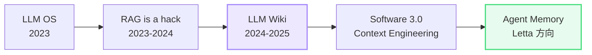

# Karpathy 路线：从 RAG 到 Agent Memory

> [上一篇](02-agent-loop.md) 讲了 Agent 为什么必须是循环。这篇看一个更长期的问题：Agent 的知识和记忆该怎么组织？Karpathy 从 2023 年起的一系列公开发言，给出了一条清晰的演进路线。

**观点标识说明**：📚 事实；🔍 分析；💡 作者观点。

---

## 第一章 不是一个产品，是一组收敛的思想

📚 Andrej Karpathy 从 2023 年起，在多次公开演讲和社交媒体上提出了关于 LLM 知识管理的一系列主张。这些主张不是一次性发布的产品路线图，而是在不同时间点逐步收敛出来的思想脉络：

🔍 五个主张之间有递进关系：先用类比定义问题（LLM OS），再否定现有方案（RAG is a hack），然后提出替代方案（LLM Wiki），接着定义新的工程学科（Context Engineering），最后指向落地方向（Agent Memory）。下面逐个展开。

---

## 第二章 五个主张

### 主张一：LLM OS（2023）

📚 Karpathy 在 2023 年的演讲中提出类比：LLM 是新操作系统的内核，context window 是 RAM，知识库是磁盘，工具是外设。

🔍 这个类比的关键不是 LLM 像操作系统，而是它暗示的推论：传统 RAG 只是一种临时补丁，就像操作系统出现之前用户手动管理内存。有了 OS 内核，内存管理应该由系统自动处理，而不是用户手动搬运。

### 主张二：「RAG is a hack」（2023-2024，多次提到）

📚 Karpathy 的核心论点：人类不是靠「在图书馆搜相似段落」来记住知识的。

🔍 把文档切碎塞进 embedding，用户提问时检索相关片段拼进 prompt——这是搜索引擎的变体，不是知识的组织方式。RAG 解决了「怎么让模型看到外部信息」的问题，但没解决「知识怎么被持续整理和更新」的问题。

### 主张三：LLM Wiki（2024-2025）

📚 这是五个主张里最具体的一个设想：模型自己读写一个 wiki 风格的知识库。

跟 RAG 的核心区别：

| 维度 | RAG | LLM Wiki |
|---|---|---|
| 谁组织知识 | 人切分文档，embedding 索引 | 模型自己编辑、去重、归纳、交叉引用 |
| 知识状态 | 灌进去之后是死的 | 被持续整理的活体制品 |
| 类比 | 图书馆的搜索引擎 | 人类维护的 Notion / Obsidian |

### 主张四：Software 3.0 / Context Engineering（2025）

📚 Karpathy 提出 Software 3.0 的分代：

- Software 1.0 = 人写代码
- Software 2.0 = 人标数据，模型学
- Software 3.0 = 人管上下文，模型执行

🔍 这意味着核心工程技能从「写算法」变成「管理上下文」。Prompt + Context 本身就是编程——这直接催生了 Context Engineering 作为一个新的工程学科。截至 2025 年，这个概念已经被 Anthropic 等公司在工程实践中广泛采用。

### 主张五：Agent Memory（2024-2025）

📚 Karpathy 明确认为 Letta / MemGPT [1] 这类方向比朴素 RAG 更接近正确答案：模型应该有分层记忆（工作记忆 + 长期存储），能在空闲时整理知识（sleep-time compute），而不是每次都从头检索。

🔍 但他也指出，截至 2025 年所有 Memory 系统都还很粗糙。这是一个方向判断，不是一个已解决的问题。

---

## 第三章 谁在落地这条路线

📚 截至 2025 年底，各家的进展：

| 公司 / 项目 | 对应哪一步 | 做了什么 |
|---|---|---|
| Anthropic | Skills / Artifacts / Projects / CLAUDE.md | 用户可管理的结构化知识制品 + 跨会话记忆 |
| OpenAI | Memory / Custom GPTs | 跨会话记忆 + 个性化 |
| Letta (MemGPT) | 全栈 Agent Memory | 分层记忆 + sleep-time compute [1] |
| Mem0 | Memory 抽象层 | 轻量级记忆 API |
| LangGraph | State + Checkpointing | 工作流状态持久化 |

🔍 从这张表能看出一个规律：大公司（Anthropic、OpenAI）从产品侧切入，先做用户可见的记忆功能；开源项目（Letta、Mem0）从基础设施侧切入，做通用的记忆层。两条路最终会汇合——产品需要基础设施来支撑，基础设施需要产品来验证。

---

## 我的思考

💡 两个判断：

**Karpathy 路线的核心洞察是「知识应该是活的」。** RAG 把知识当成静态数据库来查，LLM Wiki 把知识当成活体制品来维护。这个区分比具体的技术方案更重要——不管最终用什么实现，「模型应该能主动整理自己的知识」这个方向不会错。

**Context Engineering 的提出标志着 Agent 工程进入第二阶段。** 第一阶段（2023-2024）解决的是「Agent 能不能调工具、能不能完成任务」；第二阶段（2025 起）解决的是「Agent 的上下文怎么管、知识怎么组织」。Karpathy 路线本质上是在描述第二阶段的技术方向。

---

## 参考资料

[1] Packer, C. et al. (2023). MemGPT: Towards LLMs as Operating Systems. *arXiv:2310.08560*.

### 延伸阅读

- [上一篇：为什么 Agent 必须是循环](02-agent-loop.md)
- [从 RAG 到 Memory 演化](../deep-topics/memory/rag-to-memory.md) — 商业价值分层 + 各方向判断
- [MemGPT/Letta 入门指南](../deep-dives/memgpt-letta/memgpt-letta-guide.md) — 用秘书比喻理解三级记忆
