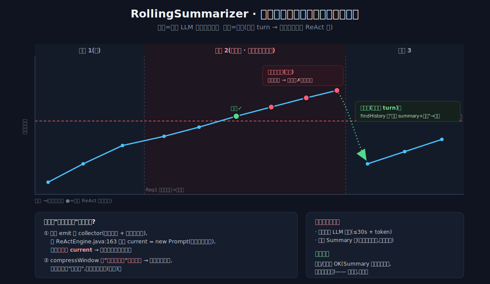

# LLM Agent 上下文窗口管理:从一个"每轮重复摘要"的 bug 说起



*横轴=时间(请求 turn → 每个请求内的 ReAct 轮)。**跨请求**(请求2→3 边界)窗口因重建而回落 ✅;但**同一请求内**(请求2 多轮)只增不减,越过 12000 阈值后每轮重摘 ✗。两个尺度同框,后文 §4.3 拆根因。*

> 做 AI Agent 的对话系统时,我们给"滚动摘要器"设了个阈值:窗口字符数超过 12000 就触发一次 LLM 摘要,把旧对话压成一段。上线前压测发现一个反直觉的现象:**同一次请求里,一旦窗口越过阈值,之后每一轮都会再触发一次摘要**——白烧延迟和 token。
>
> 顺着这个 bug 往下挖,发现它不是孤立问题,而是一个**有成熟方法论、大量开源实践**的问题域。本文把它沉淀下来:**① 这事属于哪个问题域 → ② 通用方法论 → ③ 开源社区/厂商最佳实践 → ④ 我们的设计取舍与那个 bug 的根因/解法**。
>
> 术语对齐 2025–2026 业界(Anthropic「context engineering」、Chroma「context rot」等)。适用读者:做 Agent / RAG / 对话系统的工程师。

---

## 一、问题域定位:这是「上下文工程」里的「短期记忆 / 窗口管理」子域

### 1.1 它在地图上的位置

Anthropic 把这一整片叫 **Context Engineering(上下文工程)**——"在推理时,策划与维护那组最优 token 的策略集合",比 prompt engineering 更宽(涵盖 system prompt、工具定义、外部数据、对话历史)。([Anthropic](https://www.anthropic.com/engineering/effective-context-engineering-for-ai-agents))

在它下面,我们碰的是 **短期记忆 / 上下文窗口管理(Short-term Memory / Context Window Management)**。一个 Agent 的"记忆"通常分层:

| 层 | 名称 | 载体 | 典型实现 |
|---|---|---|---|
| **L1** | In-context / 工作记忆 | 当前喂给 LLM 的 prompt 窗口 | ReAct 循环里的当轮 Prompt |
| **L2** | 短期记忆(单会话) | 本会话历史(可压缩/可截断) | 持久化的对话事件流 + 滚动摘要 |
| **L3** | 长期记忆(跨会话) | 向量库 / 事实库 / 文件 | RAG 记忆 / 抽取式记忆 |

> 关键澄清:**context window ≠ effective context**。窗口能塞 32K 不代表模型能有效用 32K——见 §1.3。

### 1.2 这个子域内部其实有三个不同的子问题(常被混为一谈)

1. **对话历史增长**——多轮累积,迟早撑爆窗口。→ 截断 / 摘要。
2. **工具输出膨胀**——单个工具返回可能是 MB 级 dump,是 Agent 循环里**最大、最不可复用**的 token 消耗。→ 工具边界截断 / 清除。
3. **跨会话长期记忆**——"它怎么不记得我上次说的"。→ RAG / 事实抽取。

这三者是**不同机制**,实现上也该是不同组件,不该混谈。本文那个 bug 属于**子问题 1**。

### 1.3 为什么必须管 —— 三个被反复验证的失效模式

- **Lost in the Middle(中间遗失)**:模型对上下文**首尾**的信息召回最好,**中间显著退化**,呈 U 形曲线——即使是长上下文模型也如此。→ 关键事实要放窗口**头或尾**,别埋中间。(Liu et al., TACL 2024,[arXiv:2307.03172](https://arxiv.org/abs/2307.03172))
- **Context Rot(上下文腐烂)**:输入 token 越多,输出质量**单调下降**;Chroma 在 18 个前沿模型(GPT-4.1 / Claude Opus·Sonnet 4 / Gemini 2.5)上测得 F1 随长度递减,归因为 **transformer attention 的架构属性**(n² 两两关系 → 注意力稀释),不是训练不足。([Chroma Research](https://research.trychroma.com/context-rot))
- **Attention Budget(注意力预算)有限**:每多一个 token 都在消耗有限的注意力。→ "更大窗口"不是答案,**curation(策划/裁剪)**才是。([Anthropic](https://www.anthropic.com/engineering/effective-context-engineering-for-ai-agents))

外加工程现实:**内联摘要 = 热路径上多一次 LLM 往返**(延迟 + 成本 + 非确定性),且非确定性会破坏**可重放 / 审计**。

---

## 二、通用方法论:五类策略 + 两条正交轴

### 2.1 策略家族(按"压什么、怎么压")

| 策略 | 机制 | 优 | 劣 | 何时用 |
|---|---|---|---|---|
| **截断 / 滑动窗口** | 丢最老的,留最近 N | 廉价、**确定性、可重放**、零额外 LLM | 有损硬丢;早期精确事实没了;无语义感知 | 默认基线;短对话;确定性 > 召回 |
| **摘要 / 压缩(Compaction)** | LLM 把旧轮压成一段 | 语义保留、长程连贯、省 token | 有损**且非确定性**;加延迟/成本;精确细节被"压没";不可重放 | 长会话逼近窗口上限 |
| **检索 / RAG 记忆** | 卸到向量库,按需取回 | 规模无上限;只取相关片 | 受检索质量制约;需索引基建;干扰项风险 | 大知识库 / 跨会话长期 |
| **混合 / 分层** | 近期原文 + 中期摘要 + 远期检索 | 召回/成本最优,贴合 lost-in-the-middle | 最复杂,多个调参面 | 生产级长会话 + 大语料(理想终态) |
| **Token 预算 / 保留近 K 轮原文** | 在以上策略**之上**的治理策略 | 近期最能预测下一步;保护 live 窗口确定性 | K/阈值是启发式;有边界突变 | **永远**(是统领其它策略的策略) |

### 2.2 两条正交轴(更本质的分类)

把上面投到 2×2,能一眼看清取舍:

```
                  确定性(deterministic)        LLM 驱动(non-deterministic)
   无损(lossless)  服务端状态/全量重放(贵)        —(摘要必有损)
   有损(lossy)     截断 / 滑动窗口 ★可重放         摘要 / 事实抽取 ★语义保真
```

- **确定性 × 有损 = 截断**:工具输出、硬上限场景的首选(可重放、可测试、零 LLM)。
- **LLM × 有损 = 摘要/抽取**:对话历史、需保语义处,**省着用**,且别放进被审计的原始事件流。

### 2.3 跨策略的通用原则(各家共识)

1. **保留近期 K 轮原文**(recency 最相关)+ **关键事实置于头/尾**(对抗 lost-in-the-middle)。
2. **持久化原始事件,只对"派生视图"做摘要**——摘要非确定性,不进审计流。
3. **工具输出在边界就截**(分页/过滤/截断),别让 MB dump 进窗口;Claude Code 默认把工具返回截到 **25K token**。([Anthropic — Writing tools for agents](https://www.anthropic.com/engineering/writing-tools-for-agents))
4. **递归摘要(summary-of-summaries)**——摘要本身会增长,需可再压。
5. **增量摘要要带"已压到哪"的游标**——否则会重复压(正是本文那个 bug,见 §4.3)。

---

## 三、开源社区 / 厂商最佳实践

> 行业已**收敛**到同一个两层形状:**确定性近期窗口裁剪 + LLM 摘要溢出部分**;并正在标准化「保留 tool_use 调用记录、只清结果体」的工具压缩。

### 3.1 Anthropic — Context Engineering

三个机制(均官方 cookbook,API 串是带日期的 beta,实现前需核对当前值):

| 机制 | 触发 | 保留 vs 丢弃 |
|---|---|---|
| **Compaction(压缩)** | 服务端 `input_tokens` 阈值(示例 150K) | 全历史 → 一个 summary 块;保留"架构决策/未解 bug/关键实现",丢"冗余工具输出" |
| **Tool-result clearing(工具结果清除)** | 服务端 token 阈值(示例 30K) | **保留 `tool_use` 调用记录** + 最近 N 个结果,旧结果体替换为 `"[cleared…]"` 占位,**可被重新调用取回** |
| **Memory tool(记忆工具)** | **模型自主**调用 | 文件式 `view/create/str_replace/...`,持久化由你实现(磁盘/DB),跨会话 |

提出术语 **context rot**;把工具结果清除称为"最轻量的压缩":*"工具结果一旦沉到历史深处,Agent 为什么还要再看原始结果?"*——**保留调用记录、只清结果体**是比"整轮丢弃"更优的做法(模型仍知道调过、且可重取)。与 **prompt cache** 的关系:清除会让清除点之后的缓存前缀失效。([Anthropic context engineering](https://www.anthropic.com/engineering/effective-context-engineering-for-ai-agents) · [cookbook](https://platform.claude.com/cookbook/tool-use-context-engineering-context-engineering-tools))

### 3.2 OpenAI — 会话状态管理

- **Responses API** `previous_response_id` / **Conversations API**:服务端维护会话状态,省去手工拼历史。⚠️ **但不省 token**——链上全部 input 仍按 input 计费。服务端状态是**便利**,不是成本优化。
- **Assistants API `truncation_strategy`**:`auto`(智能截断)或 `last_messages`(保留最近 N 条)。([OpenAI conversation-state](https://developers.openai.com/api/docs/guides/conversation-state))

### 3.3 LangChain — 拆成「确定性裁剪 + LLM 摘要」两件套

- **`trim_messages`**(确定性,不调 LLM):`strategy="last"` 保留最近;**传 `len` 当 token_counter 即按"消息条数"裁**;`include_system=True` 钉住 system。
- **关键防呆**:`start_on="human"`、`end_on=("human","tool")`——保证裁剪边界**永不停在悬空的 tool_call/tool_result 上**(对 ReAct Agent 是真实正确性问题)。
- **`Conversation*Memory` 全家桶自 v0.3.1 弃用** → 由 LangGraph checkpointer 持久化 + `trim_messages` + `langmem` 摘要取代。
- **`langmem` 的 `SummarizationNode` / `RunningSummary`**:增量滚动摘要,带 `last_summarized_message_id` 游标,**只处理未摘过的消息**、新摘要合并旧摘要,输出 `[summary] + 近期原文`,在 `pre_model_hook`(每次 LLM 调用前)**内联同步**跑。那个 `last_summarized_message_id` 游标,正是防止重复压缩的关键。([trim_messages](https://reference.langchain.com/python/langchain-core/messages/utils/trim_messages) · [langmem](https://langchain-ai.github.io/langmem/reference/short_term/))
- ⚠️ 连 langmem 自己都踩过"摘要不合并旧摘要 → 重复工具调用循环"的坑([#118](https://github.com/langchain-ai/langmem/issues/118))——和本文 bug 同源。

### 3.4 LlamaIndex — 统一 `Memory`:短期 FIFO + 溢出刷入长期块

- 旧 `ChatSummaryMemoryBuffer`(已弃用):近期原文 + 对溢出**内联 LLM 摘要**,`.get()` 时按 `token_limit` 触发。
- 新 `Memory`:短期 FIFO 占 `chat_history_token_ratio`(默认 0.7)预算,溢出按 `token_flush_size`(默认 3000)**把最老的刷入长期块**—— `StaticMemoryBlock` / `FactExtractionMemoryBlock`(LLM 抽事实)/ `VectorMemoryBlock`(向量召回);`priority=0` 永留。要做 L3,这是现成蓝图。([LlamaIndex Memory](https://developers.llamaindex.ai/python/framework/module_guides/deploying/agents/memory/))

### 3.5 MemGPT / Letta — 「LLM as an OS」虚拟上下文

- **main context vs external context**(类比 RAM vs 磁盘 + 分页);main 含 system / FIFO 消息队列 / 可自编辑 working context;external 含 **recall memory**(全历史可搜)+ **archival memory**(向量库)。
- **memory pressure** 触发**队列驱逐**,溢出做**递归摘要**;跨层移动靠 **LLM 显式 function call 分页**(不是隐式 RAG)。([MemGPT, arXiv:2310.08560](https://arxiv.org/abs/2310.08560))

### 3.6 Mem0 — 抽取式记忆(不存原始历史)

- 不留原文,**LLM 抽取要点**存事实库;两阶段:抽取(输入 = 滚动摘要 S + 近期窗口 + 当前交换)→ 更新(对每条候选事实做 **ADD / UPDATE / DELETE / NOOP**)。
- LOCOMO 上声称 **token ↓~90%**(~1.8K vs ~26K)、p95 延迟 ↓~91%、质量 +26%。是可选 **L3** 层,比摘要重(多一次抽取 LLM + 向量库),但若做跨会话长期记忆 + 要"省 token"叙事,这是范式。([Mem0, arXiv:2504.19413](https://arxiv.org/abs/2504.19413))

### 3.7 Spring AI — 只给了窗口,没给摘要

- `ChatMemory` 接口 + **`MessageWindowChatMemory`(默认实现,默认窗口 20 条消息**,溢出丢最老、保 system);仓库 `InMemory` / **`JdbcChatMemoryRepository`(Postgres 等)**;Advisor 用 `MessageChatMemoryAdvisor`(`PromptChatMemoryAdvisor` 自 1.1.3 弃用)。
- **开箱即用只有窗口化,无任何摘要/压缩策略**(官方文档明确)。摘要在孵化中的 **Session API**(事件溯源 + 递归 LLM 摘要,约 Spring AI 2.1),未 GA。**也就是说,基于 Spring AI 做滚动摘要 + 工具截断,是净新增的应用层逻辑**——等于手搓未来 Session API 想标准化的东西。([Spring AI ChatMemory](https://docs.spring.io/spring-ai/reference/api/chat-memory.html) · [Session API blog](https://spring.io/blog/2026/04/15/spring-ai-session-management/))

---

## 四、我们的设计取舍

### 4.1 实现落在方法论的哪儿

| 子问题 | 我们的策略 | 策略归类 | 对齐的最佳实践 |
|---|---|---|---|
| 工具输出膨胀 | 确定性截断(8KB,UTF-8 边界 + 血缘 marker) | 确定性 × 有损 | Anthropic「最轻量压缩」/ 工具边界截断;**但我们是丢尾,非"留调用记录+占位"** |
| 对话历史增长 | LLM 滚动摘要(char/round 阈值,保留近 K,失败有非 AI fallback marker) | LLM × 有损 | langmem `RunningSummary` / LlamaIndex `ChatSummaryMemoryBuffer` |
| 持久化 | 事件流存 PG,summary 作 checkpoint,重建时取"最新 summary + 其后原文" | 存原始事件,摘要派生视图 | 与"不把摘要放进审计流"一致 |
| 跨会话长期 | 暂不做 | — | 推后(Mem0 / LlamaIndex blocks) |

### 4.2 关键取舍 & 为什么

面向 **3–30 户小规模 + 单人维护 + 可灰度迭代** 的约束:

| 决策 | 取舍 | 理由 |
|---|---|---|
| 字符阈值(12000)而非 tokenizer | 牺牲精度,换"零依赖、保守余量" | 精度不影响核心目标;精确 tokenizer 推后 |
| 工具截断用**确定性**(非 AI) | 牺牲语义,换可重放/可测试/零延迟 | 热路径上每次工具调用都过;幂等重放测试依赖确定性 |
| 摘要默认用 **LLM**(带非 AI fallback) | 牺牲确定性,换关键事实保真 | 业务场景丢关键 ID / 已排除路径伤体感大 |
| 摘要**只在请求边界生效** | in-loop 不真瘦身 | 实现简单;但引出 §4.3 的 bug |
| 不上 RAG / L3 / graph | 砍掉"未来才有压力"的建设 | 精度过度的全推后 |

### 4.3 一个典型陷阱:增量摘要的「幂等」与「回灌」

这就是开头那个 bug 的根因。要分清**两个时间尺度**(图里同框):

| 尺度 | 窗口怎么变 | 结论 |
|---|---|---|
| **跨请求**(下一次对话 turn) | 下次请求用"最新 summary + 其后原文"重建窗口 → **起始窗口回落** | ✅ 符合直觉 |
| **同一请求内**(ReAct 跨轮) | 每轮窗口从全量工具历史重建,摘要 emit 出去但**不回灌当前窗口** → **只增不减** | ⚠️ 越线后每轮重摘 |

**根因两条**:

1. 摘要只 emit 给持久化 / 下次重建用,**不修改当前 in-flight 的窗口** → 当前请求窗口不缩;
2. 触发判断**无"本批已压过"的幂等游标** → 窗口既然只增不减、越线后恒在线上,于是每轮都判"需压缩",重复触发。

**代价**(每多触发一次):多一次摘要 LLM 调用(延迟 + token)+ 多写一条冗余 summary(下次只取最新,其余白做)。
**不会坏的**:摘要落在干净的轮边界,重建结构合法、结果正确——**是浪费,不是错**。

**业界现成解法**:

| 问题 | 解法 | 出处 |
|---|---|---|
| 重复压缩 | 带 `last_summarized_message_id` 之类的游标,只压未压过的、新摘要合并旧摘要 | langmem `RunningSummary` |
| in-loop 不瘦身 | 摘要后用 `[summary] + 近期 K` **回灌**当前窗口 | langmem `pre_model_hook` 输出 |
| 近期原文按"条数"而非"轮次"切,易切散 tool_call/tool_result 对 | 按轮边界切;裁剪边界用 `end_on=("human","tool")` 防呆 | LangChain `trim_messages` |
| 工具截断只丢尾、破坏结构、模型失去"调过该工具"感知 | 保留 `tool_use` 调用记录 + 占位符,旧结果体可重取 | Anthropic `clear_tool_uses` |

> 有意思的是:**langmem 自己也踩过同源的坑**([#118](https://github.com/langchain-ai/langmem/issues/118))——说明"增量摘要不带游标 → 重复压缩"是这个模式的**典型陷阱**,而不是个例。

### 4.4 取舍原则一句话

> **能确定性、可重放的(工具截断)就别上 LLM;必须保语义的(对话历史)才上 LLM,且只压派生视图、存原始事件;精度过度的(tokenizer / RAG / graph)一律推后到有压力再说。** 这套"最小可重放集"换来的是小团队能灰度迭代、出问题能复现——代价是几处有现成解法的技术债(§4.3)。

---

## 五、参考资料

**方法论 / 失效模式**
- Liu et al., *Lost in the Middle*, TACL 2024 — https://arxiv.org/abs/2307.03172
- Chroma Research, *Context Rot* — https://research.trychroma.com/context-rot

**厂商**
- Anthropic, *Effective context engineering for AI agents* — https://www.anthropic.com/engineering/effective-context-engineering-for-ai-agents
- Anthropic, *Writing effective tools for agents* — https://www.anthropic.com/engineering/writing-tools-for-agents
- Anthropic cookbook, *memory / compaction / tool clearing* — https://platform.claude.com/cookbook/tool-use-context-engineering-context-engineering-tools
- OpenAI, *Conversation state* — https://developers.openai.com/api/docs/guides/conversation-state

**框架**
- LangChain `trim_messages` — https://reference.langchain.com/python/langchain-core/messages/utils/trim_messages
- LangChain 弃用 memory 迁移 — https://python.langchain.com/docs/versions/migrating_memory/
- LangMem 短期记忆 — https://langchain-ai.github.io/langmem/reference/short_term/
- LlamaIndex Memory — https://developers.llamaindex.ai/python/framework/module_guides/deploying/agents/memory/
- Spring AI ChatMemory — https://docs.spring.io/spring-ai/reference/api/chat-memory.html
- Spring AI Session API(孵化)— https://spring.io/blog/2026/04/15/spring-ai-session-management/

**记忆系统**
- MemGPT, arXiv:2310.08560 — https://arxiv.org/abs/2310.08560
- Mem0, arXiv:2504.19413 — https://arxiv.org/abs/2504.19413
