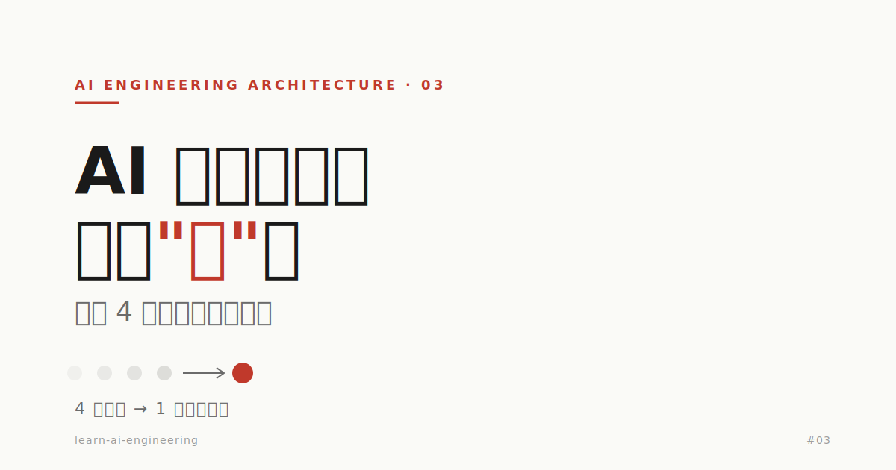
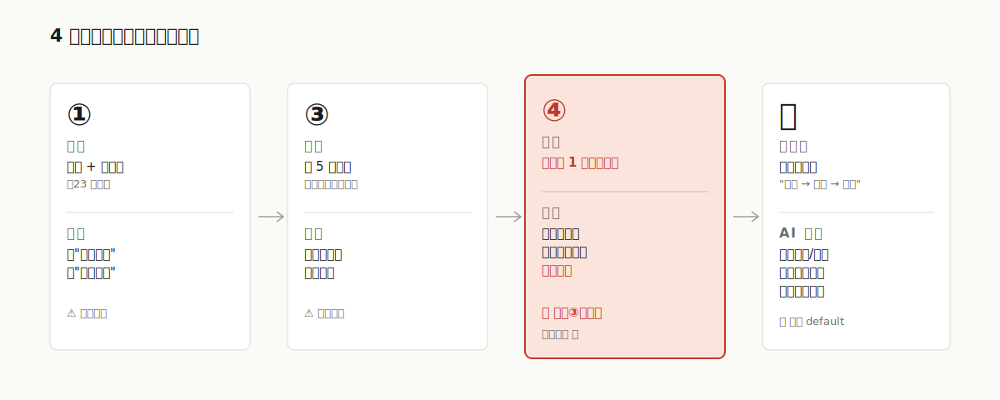
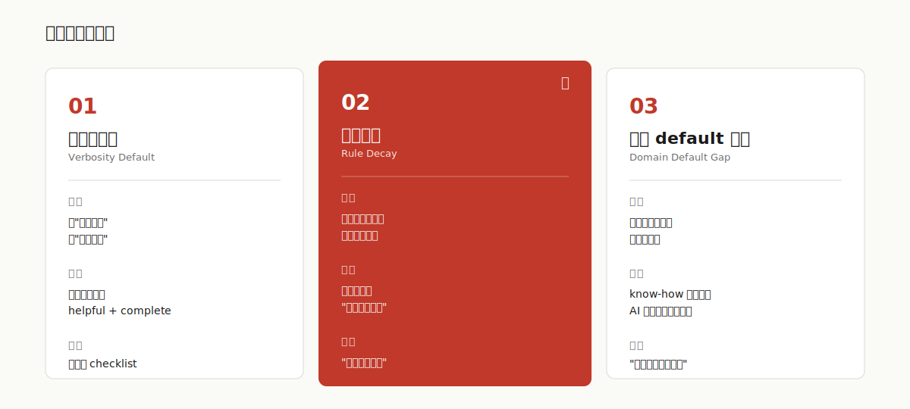
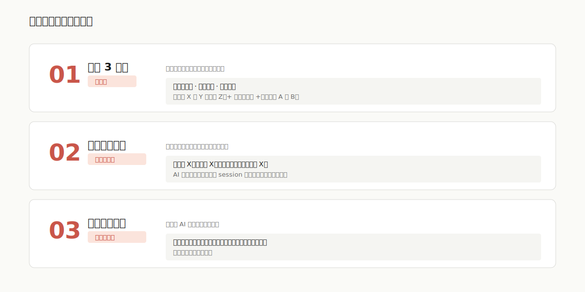

# AI 不是不懂，是会"忘"——一次 4 轮迭代的真实复盘



> 我让 AI 修一张 markdown 表格，4 轮才改对。原始指令 23 个字，迭代花了 40 分钟。
>
> 不是 AI 不够强，也不是我说不清楚——是一个大多数人没意识到的协作反模式。

## 1. 4 轮发生了什么

场景：一份要直接发给商户客户的接口接入说明 md。一张概述表格，列出 4 个测试用例，每个用例需要补一列"方法运行前置条件"。

我的第①轮指令（23 个字）：

> 概述的表格异常 修复下；方法运行前置条件 填写好

AI 第①轮的产出，是给每个用例都列了 3 点详细前置——包括「已配置商户号 merchantNo 与 appId」「已开通付款码支付权限」这类状态描述。

我最终手动改完的版本，长这样：

> 打开微信付款码，点击条形码获取付款码数字，填入 authCode（勿截图，截图后付款码会失效）。

中间隔了 3 轮纠偏。



把每轮的偏差点列出来：

| 轮次 | 指令要点 | AI 偏差 | 严重度 |
|:---|:---|:---|:---:|
| ① | 修表 + 填前置 | 把"状态描述"当"操作步骤" | ⚠️ |
| ③ | 立 5 条规则：不说已配置/不需要留空/加路径/删多余/加概括 | 都做了，但简化过头丢了关键信息 | ⚠️ |
| ④ | "用例 1 用上一版" | 直接复制回第①轮版本，把"已配置 merchantNo"塞了回去——**违反③轮明确规则** | 🔴 |
| 最终 | 我手动改 | AI 缺失"用户被扫/主扫""截图失效警示""转码工具链接" | 🟡 |

第④轮是质变点：AI 在 30 秒前刚同意「不要说已配置的内容」，下一轮就因为「用上一版」这个新指令把禁掉的内容又塞了回来。

## 2. 三个底层反模式

这次 case 不是孤例，是三个可识别、可命名的反模式同时发作。



### 反模式 1：完整性偏好（Verbosity Default）

**现象**：AI 默认给覆盖全面的回答，把"状态清单"和"操作手册"混为一谈。

**根因**：训练目标奖励 helpful + complete，对"克制"和"留白"没有正反馈。

**本次表现**：把「已配置 X」列为前置条件——AI 视角下这是"信息完整"，客户视角下这是"废话"。

**识别信号**：输出读起来像 checklist，但你需要的是 step-by-step。

### 反模式 2：规则衰减（Rule Decay）⭐

**现象**：早期 session 立的规则，在后续 N 轮迭代中被新指令悄悄冲掉。

**根因**：AI 优先满足当前指令的字面意思，没有自动机制校验"是否违反此前约束"。

**本次表现**：第④轮指令「用上一版」字面意思是"复制回去"，AI 完全忽略第③轮立的"不说已配置"规则。

**识别信号**：你脑中冒出「这条我说过啊」的瞬间——就是规则被冲掉了。

**最可怕的地方**：AI 不会主动告诉你「这和你之前说的冲突」，它默默选了一个。

### 反模式 3：领域 default 盲区（Domain Default Gap）

**现象**：行业内的默认共识 AI 不懂，但又不主动问。

**根因**：训练数据里 know-how 是"暗知识"，没明确标注；AI 也不知道自己不知道。

**本次表现**：不知道支付场景"用户被扫 vs 用户主扫"是基本区分；不知道"付款码截图会失效"是必须警示的；不知道"转二维码"客户需要具体工具链接。

**识别信号**：你需要给 AI 补「这难道不是常识吗」——就是盲区。

## 3. 三个可复制的协作公式

识别问题之后，给三个立刻能用的工具。



### 公式 1：开场 3 件事（治根本）

任何复杂任务前，先一次性说清楚这 3 件事：

```text
1. 受众与用途：「这份 X 给 Y 看，他们要 Z」
2. 风格样例：贴一段你想要的具体输出样式（最强信号）
3. 领域维度：「这个场景要区分 A 和 B」「行业惯例是 C」
```

❌ 我实际用的开场：

> 概述的表格异常 修复下；方法运行前置条件 填写好

✅ 改良版：

> 这份 md 直接发给商户客户，他们照做要能跑通接口。
> 前置条件按"打开 X → 点击 Y → 填入 Z"的动作格式写，不要列"已配置 XX"这类状态。
> 支付场景要区分用户主扫/被扫。

这一句开场，预计能把 4 轮压缩到 1 轮。

### 公式 2：持久规则标记法（治规则衰减）

对你想要整篇 / 整个 session 持续生效的约束：

```text
用「始终」「整篇」「之后所有修改都遵守」标注
```

AI 看到这类语言会把它当 session 级约束，而不是单次指令。例：「**整篇文档始终**不要列已配置项作为前置条件」。

### 公式 3：冲突反问模板（治指令冲突）

主动给 AI 一个反问的钩子：

```text
「如果这条和我之前说的有冲突，先告诉我，不要自己决定」
```

一句反问省一整轮迭代。

## 4. 这是协作契约问题，不是 AI 问题

别在"prompt 工程"这个层级打转，往上跳一层。

这些反模式不是 AI 独有——新员工、外包、跨团队协作里**同样**会出现完整性偏好、规则衰减、领域盲区。区别是：**人类有自我 onboarding 能力**，错一次第二次会主动校准；**AI 不会**——你不立规则它就用默认。

最准确的心智模型：把 AI 当成**零经验、高带宽、健忘的实习生**。

- 零经验 → 必须给受众和样例
- 高带宽 → 一次性消化大量上下文没问题
- 健忘 → 规则要持久标注、冲突要主动反问

下次想骂 AI 不行之前，先问自己一句：

> 如果我招了一个新员工，第一天就给他你刚才给 AI 的那段话，他能做对吗？

不要问"怎么写 prompt"，要问"**我和 AI 的协作契约是什么**"。
