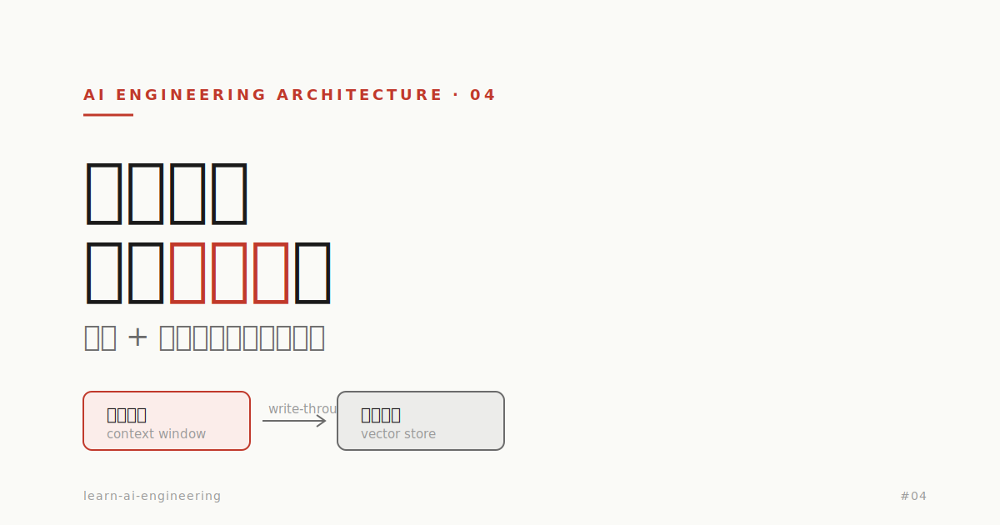

# 记忆不是塞进上下文——读完 mem0 这篇，我手搓了一个短期+长期记忆层



> 我一直把「AI 记忆」理解成「把更多东西塞进上下文窗口」。直到读完 mem0 的这篇 [Short-Term vs Long-Term AI Memory](https://mem0.ai/blog/short-term-vs-long-term-memory-in-ai)，又照着它手搓了一遍，才意识到：记忆是一个**架构问题**，不是一个 Prompt 问题。
>
> 这篇是我把译文（见 [`content/03-rag/ai-memory-short-term-vs-long-term.md`](../03-rag/ai-memory-short-term-vs-long-term.md)）落成可运行代码（见 [`code/memory/`](../../code/memory/)）之后的复盘。

## 1. 我原来的误区

在做记忆之前，我对「让 AI 记住东西」的全部理解就是一句话：**把历史对话拼进 messages 数组**。

这个理解能跑通 demo，但一上规模就崩：

- 对话一长，上下文塞满，开始花式截断；
- 截着截着，模型忘了自己是谁、忘了不能编造；
- 想让它跨会话记住用户偏好？没有，会话一结束全没了。

读完 mem0 那篇我才把问题拆对：这里其实有**两种性质完全不同的记忆**，我一直当成一种在做。

## 2. 短期 vs 长期：一张表说清差异

| 维度 | 短期记忆 | 长期记忆 |
|---|---|---|
| 位置 | 推理热路径上（上下文窗口内） | 推理链路之外（外部存储） |
| 同步性 | 同步，影响首 token 延迟 | 异步，检索时才拉进来 |
| 生命周期 | 易失，会话结束即消失 | 持久，无限期保留 |
| 成本 | 每个 token 每次推理都花钱 | 存储便宜，贵在检索质量 |
| 典型实现 | 滑动窗口 / token 预算 / Redis | 向量库 / 知识图谱 / 文档存储 |
| 主要失效 | 截断导致灾难性遗忘 | 检索不准 + 数据陈旧 |

关键认知：**短期记忆是「贵且有限」的资源，长期记忆是「便宜但难检索」的资源。** 工程上要做的，是让这两者协作，而不是把所有压力都堆给上下文窗口。

## 3. 手搓三步，把原理跑通

我没有一上来就上 Redis + Qdrant，而是先用纯内存把架构跑通（代码在 `code/memory/`，单文件可运行）。

### 3.1 短期记忆：淘汰时一定要 pin 住系统提示

最朴素的截断是「从头部砍最旧的消息」。但系统提示恰恰排在最前——于是模型最先忘掉的，就是它的身份和红线。

我在 `01_短期记忆_会话缓冲.py` 里把这个反例和正解都跑了出来：

```text
【反例】朴素截断 → 系统提示被删
  系统提示是否还在: ❌ 否——模型已忘记自己是客服、忘记禁止编造

【正确】固定系统提示 + 滑动窗口
  [system   ] 你是一个严谨的电商客服，回答必须基于订单事实，禁止编造。
  ...
  系统提示是否还在: ✓ 是——人设与红线始终在场
```

**结论：淘汰策略不能是无脑 FIFO。系统提示要 pin，其余按预算滑动。** 这一条几乎是所有「对话越长越离谱」问题的根因。

### 3.2 长期记忆：行级隔离 + 陈旧更新，是两条工程红线

长期记忆我用内存向量库实现了三件事：写入、检索 Top-K、更新。跑下来有两个点最值得记：

**第一，检索必须先按 user_id 隔离，再算相似度。** 否则用户 A 会检索到用户 B 的记忆——这是隐私事故，不是 bug。我在 `search()` 里把 `user_id` 过滤放在相似度计算之前，对应译文说的「行级安全（RLS）」。

**第二，信息变更必须连 embedding 一起换。** 用户从上海搬到广州，如果只改文本不重算向量，旧向量照样被检索回来，模型会**自信地**答出旧地址。译文管这叫「数据陈旧是无声的杀手」，我跑完 `02` 才真正体会到「无声」二字——它不报错，只是悄悄答错。

### 3.3 写穿透：把短期和长期缝起来

`03_写穿透_记忆编排.py` 是把前两步缝成一个最小智能体，五步走：

```
Ingest → 短期写入 → Check(检索长期记忆注入) → Generate → Consolidate(抽取事实写回长期)
```

最有意思的是第 5 步 **Consolidate**：让 LLM 从这一轮对话里抽取「值得长期记住的稳定事实」，再写回向量库。跑出来的效果是——

- 第 1 轮用户说「我叫 Sarah、只写 Python、别推 Java」→ 被整合成事实存入长期记忆；
- 第 2 轮让它推荐 web 框架 → 这些事实被检索回来注入上下文，它真的避开了 Java 方案。

跨轮、跨会话的记忆，就是这么来的。**Mem0 / LangMem 这类「记忆层」，本质就是把这套写穿透编排封装成一个 add() / search() 的 API。**

## 4. 从 Demo 到生产：替换清单

手搓版每一块在生产里都有对应替换，但**架构不变**——这正是先手搓一遍的价值：

| 学习版 | 生产替换 |
|---|---|
| 内存 list 当向量库 | Qdrant / pgvector / Pinecone |
| 同步 consolidate() | 异步 worker（队列 / Celery） |
| 字符数估算 token | 真实 tokenizer（tiktoken） |
| 进程内会话状态 | Redis 会话存储 |
| 手搓编排 | mem0 / LangMem 记忆层 |

## 5. 站在平台架构视角，记忆要前置设计什么

把记忆当成 AI 引擎平台的一项能力来看，下面这几条要在写第一行业务代码前就定下来（和本系列一贯的原则一致：先契约、先治理）：

- **租户隔离**：记忆按 user_id / tenant 命名空间硬隔离，检索默认带租户过滤，不靠业务层自觉。
- **被遗忘权**：删用户数据时，原始日志**和**向量 embedding 都要删——没有数据血缘（lineage）就做不到，要前置埋点。
- **整合的取舍**：不是每句「你好/谢谢」都值得存，要有过滤；存什么、存多久、怎么淘汰，都是策略，不是默认行为。
- **可观测**：检索相关性、上下文利用率、记忆命中率要能监控，否则「记忆变差」这件事你根本看不见。
- **评估**：Recall@K、Precision@K、延迟 P99——记忆质量要能量化，不能靠「感觉它记住了」。

## 6. 一句话总结

**记忆不是把更多东西塞进上下文，而是设计「什么进热路径、什么进冷存储、什么时候在两者之间搬运」。**

短期记忆给你单次对话的连贯，长期记忆给你跨会话的认识。把这两件事分开设计、再用写穿透缝起来——这是从「能跑的 demo」走到「扛得住生产」的那道分水岭。

---

**配套资料**

- 理论译文：[`content/03-rag/ai-memory-short-term-vs-long-term.md`](../03-rag/ai-memory-short-term-vs-long-term.md)
- 可运行代码：[`code/memory/`](../../code/memory/)（`01` 离线可跑，`02`/`03` 需配 `.env`）
- 原文出处：[mem0.ai · Short-Term vs Long-Term AI Memory](https://mem0.ai/blog/short-term-vs-long-term-memory-in-ai)
